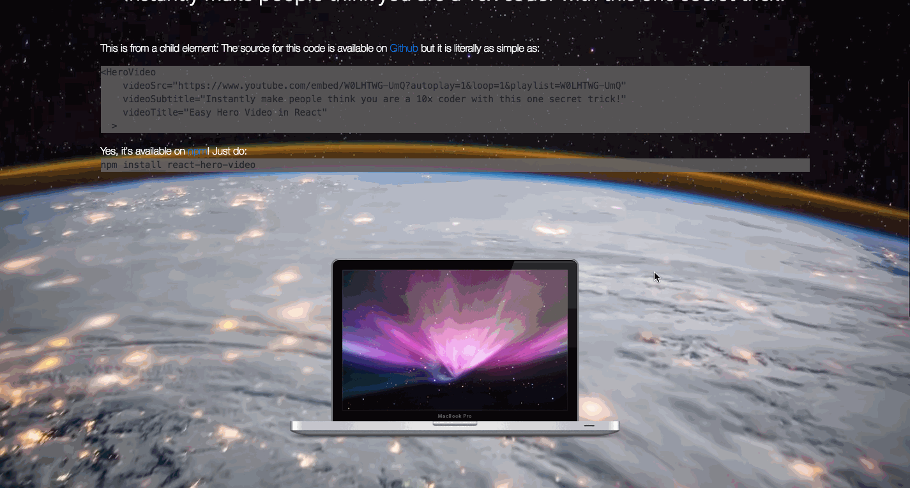

react-hero-video
=========

This module exports a react styled component that plays a video meant for background video. The current method uses the [Youtube Embedded Video API](https://developers.google.com/youtube/player_parameters) but there are other methods to embed self hosted videos.

## Demo

Check out our Demo at <https://sw-yx.github.io/react-hero-video/demo/>

## Installation

  `npm install react-hero-video`

## Usage

    import {HeroVideo} from 'react-hero-video'
    <HeroVideo
      videoSrc="https://www.youtube.com/embed/W0LHTWG-UmQ?controls=0&showinfo=0&rel=0&autoplay=1&loop=1&playlist=W0LHTWG-UmQ"
      videoTitle="react-hero-video Demo Page"
      videoSubtitle="Even though large tracts of Europe and many old and famous States have fallen or may fall into the grip of the Gestapo and all the odious apparatus of Nazi rule, we shall not flag or fail. We shall go on to the end. We shall fight in France, we shall fight on the seas and oceans, we shall fight with growing confidence and growing strength in the air, we shall defend our island, whatever the cost may be. We shall fight on the beaches, we shall fight on the landing grounds, we shall fight in the fields and in the streets, we shall fight in the hills; we shall never surrender, and if, which I do not for a moment believe, this island or a large part of it were subjugated and starving, then our Empire beyond the seas, armed and guarded by the British Fleet, would carry on the struggle, until, in God's good time, the New World, with all its power and might, steps forth to the rescue and the liberation of the old."
    >
      

        This is from a child element: The source for this code is available on{" "}
        <a href="https://github.com/sw-yx/react-hero-video">Github</a>
      

    </HeroVideo>
  
  
  It's that simple!

## Tests

  `npm test` - not maintained yet

## Contributing

In lieu of a formal style guide, take care to maintain the existing coding style. Add unit tests for any new or changed functionality. Lint and test your code.

## Inspirations

- <https://developers.google.com/youtube/player_parameters>
- <https://hackernoon.com/building-a-react-component-library-part-1-d8a1e248fe6c>
- <http://thenewcode.com/500/Use-YouTube-Videos-as-Fullscreen-Web-Page-Backgrounds>
- <https://coverr.co/>